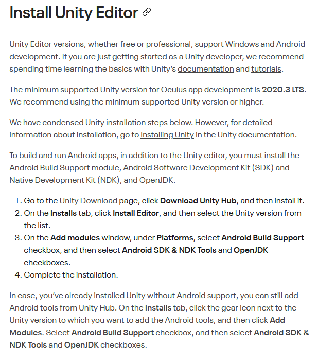
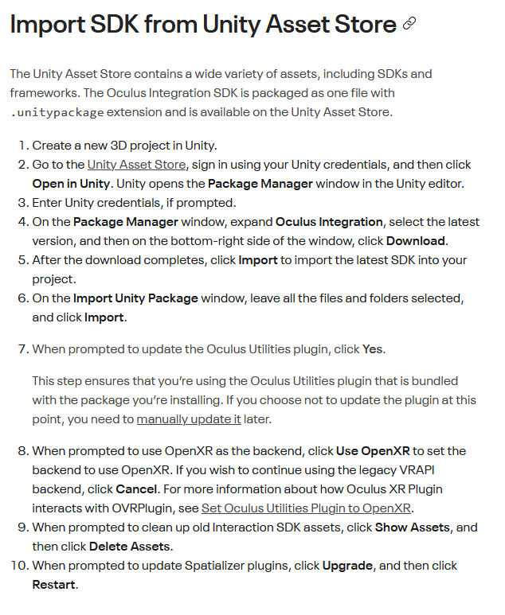
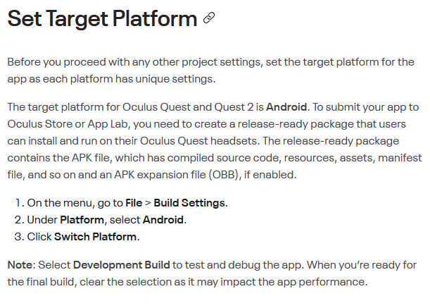
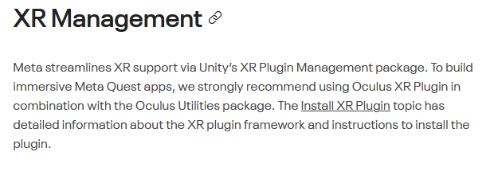
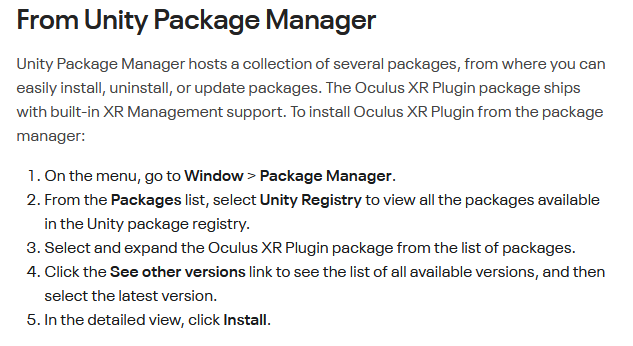
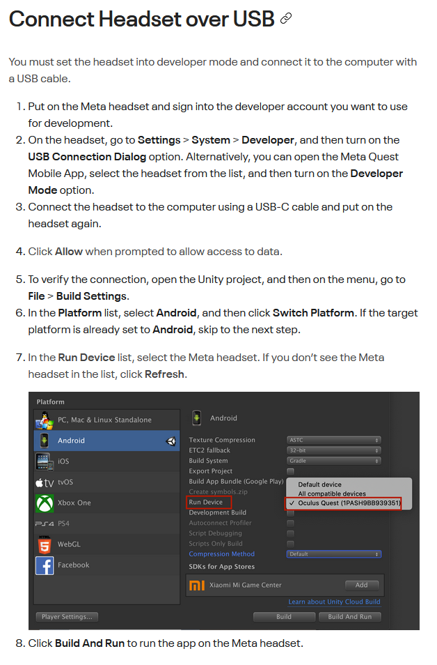

# Configuración de Meta Quest 2 para Unity

Resumen de la documentación oficial de Meta para configurar las Oculus Quest 2 y hacer que funcionen con Unity.

Documentación completa aquí: https://developer.oculus.com/documentation/unity/unity-gs-overview/

---

Oculus Integration package: https://assetstore.unity.com/packages/tools/integration/oculus-integration-82022

Información para configurar la app para la quest store (a nosotros no nos interesa): https://developer.oculus.com/documentation/unity/unity-conf-settings/

Instala el Oculus Developer Hub (ODH): https://developer.oculus.com/downloads/package/oculus-developer-hub-win/

XR Plugin: https://developer.oculus.com/documentation/unity/unity-xr-plugin/

Llegados a este punto ya deberíamos de poder ejecutar un juego en unity y verlo en nuestras gafas.

En el paso de configuración, tenemos otras cosas que podemos cambiar para mejorar el rendimiento y algunas otras cosas: https://developer.oculus.com/documentation/unity/unity-conf-settings/

Aquí podemos descargar algunos ejemplos de proyectos que utilizan estas tecnologías: https://github.com/Unity-Technologies/XR-Interaction-Toolkit-Examples

---

## Setup final

Para acabar de configurar los ajustes dentro del propio Unity seguiremos [este tutorial](https://www.youtube.com/watch?v=NWBc0y95obc): https://www.youtube.com/watch?v=NWBc0y95obc