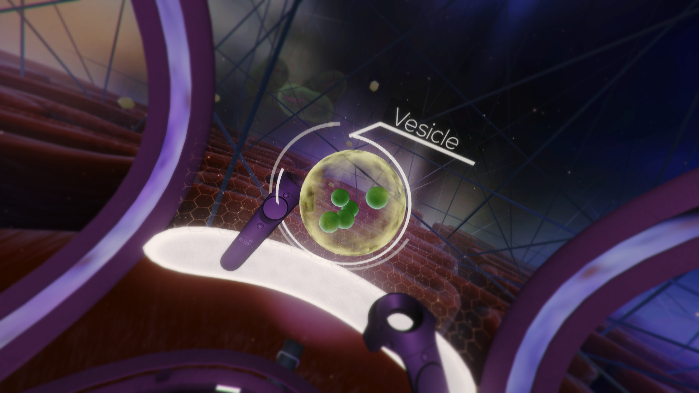
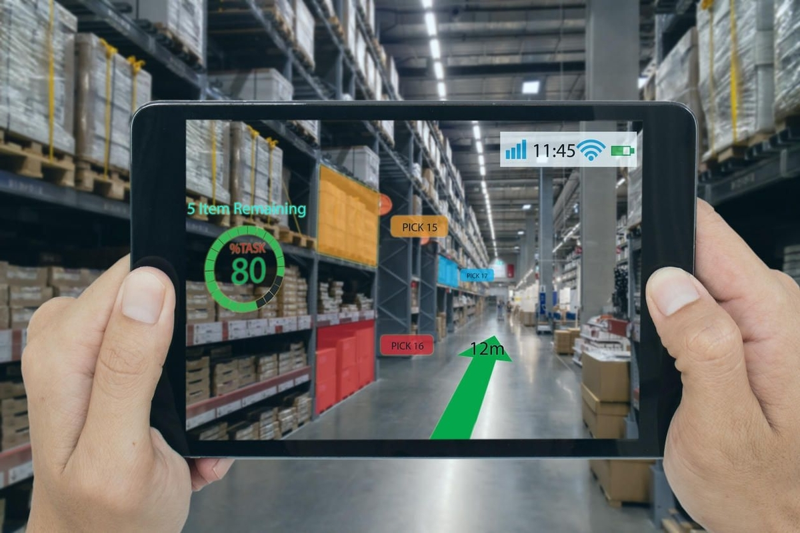
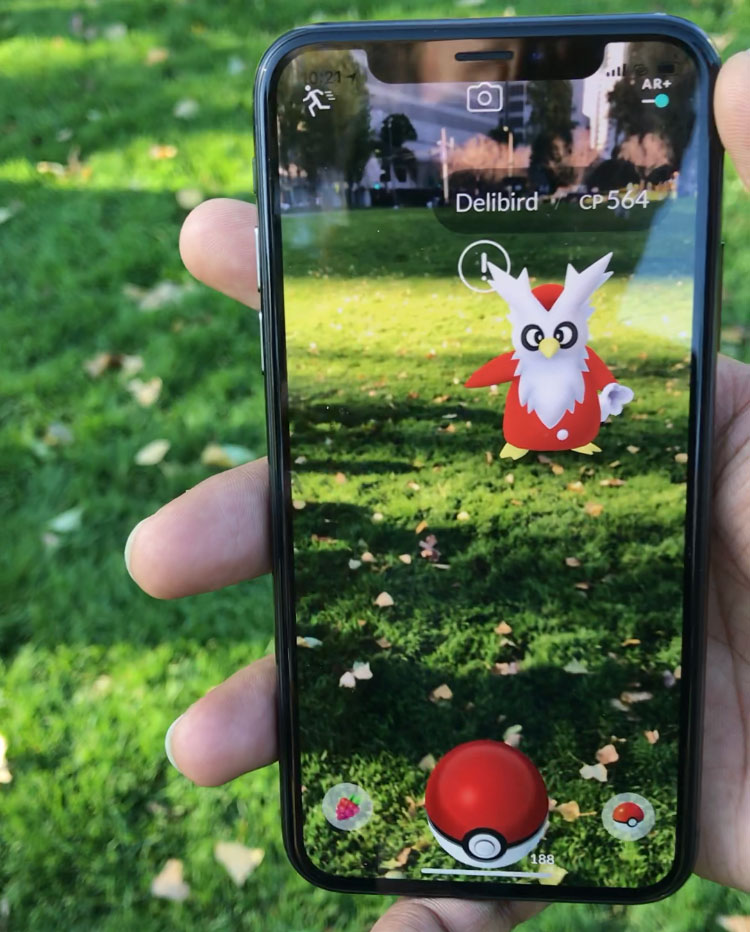
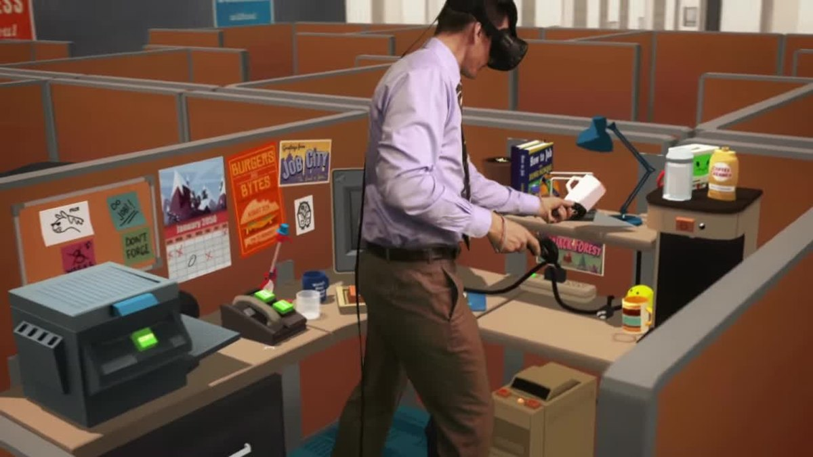

# Introducción

## Realidad Extendida

La **Realidad Extendida**, **RE** o **RX** es simplemente un término que engloba las realidades qye vamos a vert a continuación, la virtual, la aumentada y la mixta.

Aunque hoy en día ya mucha gente sabe qué es la Realidad Extendida, es importante definir algunos conceptos, más que nada porque cuando nos adentremos más en esta, veremos que hay diferentes nomenclaturas para cosas muy parecidas como Realidad Mixta o Realidad Aumentada.

## Realidad Virtual

Definiremos **R**ealidad **V**irtual, en adelante **RV**, como una recreación tridimensional virtual inmersiva de un entorno que nos permite tener la sensación de encontramos realmente dentro de él.

Para generar dicha recreación, se necesita un software avanzado y diferentes componentes externos. Una de las claves de la RV es la interactividad con el entorno virtual. Una imagen de 360° en la que simplemente visualizamos algo, no lo consideraríamos RV ya que lo único que se puede hacer es mirar.

Si necesitemos un software avanzado para crear una de estas 'simples' experiencias como la de visualizar una imagen 360°, es obvio que si queremos ir más allá y permitir la interactividad entre el mundo virtual y nosotros, necesitaremos herramientas especializadas en 3d y muy optimizadas para ejecutar el código en tiempo real. Da la casualidad que los motores de videojuegos son la solución ideal a esta necesidad. Unity en concreto soprta diferentes plugins con los que podemos desarrollar para RV, lo utilizaremos también para esta asignatura.

## Relidad Aumentada

Bien, ya sabemos qué es la RV, veamos ahora las diferencias entre esta y la **R**ealidad **A**umentada o **RA**.

La **Realidad Aumentada** es un recurso tecnológico que ofrece experiencias interactivas al usuario a partir de la **combinación entre la dimensión virtual y la física**, con la utilización de dispositivos digitales.

Es decir, que mientras que en la RV estamos sumergidos por completo en un mundo virtual, en la RA, mezclamos elementos virtuales con la realidad física.

La RA tiene muchos ámbitos de aplicación, desde los videojuegos hasta las empresas de logística. Veamos algunos ejemplos.

* Videojuegos, ([Pokémon GO](https://pokemongolive.com/es/))
* Moda, existen formas de 'probarnos' ropa, o complementos como gafas para ver cómo nos quedan.
* Logística, algunas empresas de logística y transporte han empezado ya a utilizar dispositivos con realidad aumentada sobre todo para ver cómo colocar y encajar las mercancías en sus almacenes, naves y medios de transportes. Volkswagen y Bosch son pioneras en esto.
* Publicidad, las empresas publicitarias ven un altísimo potencial en la RA para desarrollar nuevas actividades de promoción que “enganchen” a los consumidores. La empresa de publicidad Blippar por ejemplo, ya ha desarrollado una 'app' que permite escanear productos, folletos o anuncios con el móvil para iniciar experiencias interactivas en la pantalla.
* Sector inmobiliario, imagina amueblar un piso con una app primero para ver cómo queda y hacerlo después en la realidad. Esta es otra de las ideas para la RA.

Las ideas y posibilidades para la RA son casi infinitas, en este curso, veremos cómo desarrollar con esta tecnología para poder hacer nuestras pequeñas apps.

## Realidad Mixta

A parte de las más conocidas RV y RA, esxiste también la Realidad Mixta.

En **Realidad Mixta**, lo que hacemos, es también una mezcla entre entornos reales y virtuales pero no como en la RA.

La diferencia es que en la Realidad Mixta escaneamos o mapeamos de alguna forma un entorno real y lo virtualizamos, de forma que ahora podemos entrar en un entorno virtual que es exactamente igual que este entorno real.

Obviamente, a este entorno virtual, que es una imitación del real, podemos añadirle más elementos virtuales. Es como si escaneáramos nuestra propia habitación, nos pusiéramos las gafas y siguiésemos estando en nuestra habitación, pero ahora, además, hay un yeti en la cama.

Convertir los entornos reales en virtuales no es una tarea sencilla y hay varias formas de hacerlo. Dependiendo de los requisitos que tengamos nos vendrán mejor una u otras.

La forma más simple es directamente modelar el propio entorno, es decir, ir haciendo cada objeto y después montar una escena posicionando cada uno en su sitio. Si quisiérmaos por ejemplo crear un juego o una app que se desarrolla en un entorno muy concreto podríamos hacer esto. Tiene algunas ventajas, como que tenemos más nivel de control sobre la propia escena y que podemos dar diferentes propiedades a los objetos. Por ejemplo podemos hacer que una taza que hay encima de la mesa podamos cojerla pero que no podamos mover la propia mesa.

Existen técnicas más avanzadas que, por lo general, requieren dispositivos y software específico.
Hay dispossitivos capaces de escanear pequeños objetos, en vez de modelarlos podemos escanearlos y al igual que con la técnica de antes, posicionarlos en la escena.

Hay también escáneres de entornos más amplios y otra solución que parece que va ganando terreno es utilizar Inteligencia Artificial para generar esos entornos utilizando imágenes / vídeo.

## Dispositivos

D

Tethered / Stand-alone, depending if the generation of the images for each eye is carried out by
an external device or not. The final performance depends on this, as well as the user's flexibility.
3DoF or 6DoF, depending is the position of the user is tracked or not. When it is tracked, this
position can be obtained using external devices or inside-out tracking (cameras in the HMD and
position calculated processing the changes detected on these cameras ~ SLAM)
Tracking of external control devices, such as controllers. Normally either one or two (one per
hand), and generally 6DoF, and a collection of control buttons

Resolution per eye, as the screen resolution of the two displays and essential to avoid the 'screen
door' effect (when user can see the pixels and the gaps between them)
- Field of view, and the angle/s of vision covered by the device. Essential for a full immersive
experience. Quite high in VR and very limited in AR.
- Latency, as the time required to change user's view as a result of a change in their orientation or
position. It's one of the critical elements of 'VR/AR sickness' as this latency could be detected by
our vestibular/optical system, producing an asynchrony between both systems that can produce
even nauseas. Locomotion control (management of movement of the user in the space) is the
other element linked to sickness.
- Optics, each manufacturer uses a specific optics that combined with image deformation when
the image is rendered in the display, creates the desired stereoscopic effect in the user

1. Introducción
• Realidad Virtual (RV) y Realidad Aumentada (RA)
• Realidad Mixta (RM) y Realidad Extendida (RX)
• Dispositivos
2. Actualidad de la RV
• RV y Videojuegos
• Problemas e Inconvenientes Generales
3. Proyectos y Justificación
• Orientación y Posicionamiento
• Opciones para el Desarrollo en Unity
• Instalación y Configuración del Entorno en Unity
4. Proyecto RV
• Diseño de Niveles
• Interfaz Gráfica
• Ejemplo y Testeo
• Desarrollo de Proyecto
5. Proyecto RA
• Creación de Espacios, Realidad y Virtual
• Dispositivos Específicos
• Combinación de mundo Real y Virtual
• Ejemplo y Testeo
• Desarrollo de Proyecto
6. Educación y Accesibilidad
• Aplicaciones Reales, Videojuegos para el Aprendizaje
• Accesibilidad