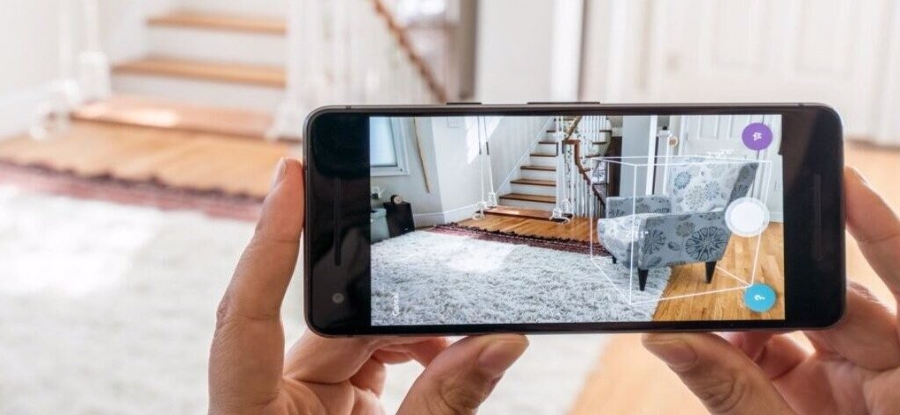

# Introducción

## Realidad Extendida

La **Realidad Extendida**, **RE** o **RX** es simplemente un término que engloba las realidades qye vamos a vert a continuación, la virtual, la aumentada y la mixta.

Aunque hoy en día ya mucha gente sabe qué es la Realidad Extendida, es importante definir algunos conceptos, más que nada porque cuando nos adentremos más en esta, veremos que hay diferentes nomenclaturas para cosas muy parecidas como Realidad Mixta o Realidad Aumentada.

## Realidad Virtual

Definiremos **R**ealidad **V**irtual, en adelante **RV**, como una recreación tridimensional virtual inmersiva de un entorno que nos permite tener la sensación de encontramos realmente dentro de él.

Para generar dicha recreación, se necesita un software avanzado y diferentes componentes externos. Una de las claves de la RV es la interactividad con el entorno virtual. Una imagen de 360° en la que simplemente visualizamos algo, no lo consideraríamos RV ya que lo único que se puede hacer es mirar.

Si necesitemos un software avanzado para crear una de estas 'simples' experiencias como la de visualizar una imagen 360°, es obvio que si queremos ir más allá y permitir la interactividad entre el mundo virtual y nosotros, necesitaremos herramientas especializadas en 3d y muy optimizadas para ejecutar el código en tiempo real. Da la casualidad que los motores de videojuegos son la solución ideal a esta necesidad. Unity en concreto soprta diferentes plugins con los que podemos desarrollar para RV, lo utilizaremos también para esta asignatura.

## Relidad Aumentada

Bien, ya sabemos qué es la RV, veamos ahora las diferencias entre esta y la **R**ealidad **A**umentada o **RA**.

La **Realidad Aumentada** es un recurso tecnológico que ofrece experiencias interactivas al usuario a partir de la **combinación entre la dimensión virtual y la física**, con la utilización de dispositivos digitales.

Es decir, que mientras que en la RV estamos sumergidos por completo en un mundo virtual, en la RA, mezclamos elementos virtuales con la realidad física.

La RA tiene muchos ámbitos de aplicación, desde los videojuegos hasta las empresas de logística. Veamos algunos ejemplos.

* Videojuegos, ([Pokémon GO](https://pokemongolive.com/es/))
* Moda, existen formas de 'probarnos' ropa, o complementos como gafas para ver cómo nos quedan.
* Logística, algunas empresas de logística y transporte han empezado ya a utilizar dispositivos con realidad aumentada sobre todo para ver cómo colocar y encajar las mercancías en sus almacenes, naves y medios de transportes. Volkswagen y Bosch son pioneras en esto.
* Publicidad, las empresas publicitarias ven un altísimo potencial en la RA para desarrollar nuevas actividades de promoción que “enganchen” a los consumidores. La empresa de publicidad Blippar por ejemplo, ya ha desarrollado una 'app' que permite escanear productos, folletos o anuncios con el móvil para iniciar experiencias interactivas en la pantalla.
* Sector inmobiliario, imagina amueblar un piso con una app primero para ver cómo queda y hacerlo después en la realidad. Esta es otra de las ideas para la RA.

Las ideas y posibilidades para la RA son casi infinitas, en este curso, veremos cómo desarrollar con esta tecnología para poder hacer nuestras pequeñas apps.

## Realidad Mixta

A parte de las más conocidas RV y RA, esxiste también la Realidad Mixta.

En **Realidad Mixta**, lo que hacemos, es también una mezcla entre entornos reales y virtuales pero no como en la RA.

La diferencia es que en la Realidad Mixta escaneamos o mapeamos de alguna forma un entorno real y lo virtualizamos, de forma que ahora podemos entrar en un entorno virtual que es exactamente igual que este entorno real.

Obviamente, a este entorno virtual, que es una imitación del real, podemos añadirle más elementos virtuales. Es como si escaneáramos nuestra propia habitación, nos pusiéramos las gafas y siguiésemos estando en nuestra habitación, pero ahora, además, hay un yeti en la cama.

Convertir los entornos reales en virtuales no es una tarea sencilla y hay varias formas de hacerlo. Dependiendo de los requisitos que tengamos nos vendrán mejor una u otras.

La forma más simple es directamente modelar el propio entorno, es decir, ir haciendo cada objeto y después montar una escena posicionando cada uno en su sitio. Si quisiérmaos por ejemplo crear un juego o una app que se desarrolla en un entorno muy concreto podríamos hacer esto. Tiene algunas ventajas, como que tenemos más nivel de control sobre la propia escena y que podemos dar diferentes propiedades a los objetos. Por ejemplo podemos hacer que una taza que hay encima de la mesa podamos cojerla pero que no podamos mover la propia mesa.

Existen técnicas más avanzadas que, por lo general, requieren dispositivos y software específico.
Hay dispossitivos capaces de escanear pequeños objetos, en vez de modelarlos podemos escanearlos y al igual que con la técnica de antes, posicionarlos en la escena.

Hay también escáneres de entornos más amplios y otra solución que parece que va ganando terreno es utilizar Inteligencia Artificial para generar esos entornos utilizando imágenes / vídeo.

## Dispositivos

Hay una gran cantidad de dispositivos de RE [*](#realidad-extendida), para organizar mejor, los dividiremos en varios grupos ya que los dispositivos tienden a ser diferentes.

## Dispositivos para RV

Los dispositivos para RV son **H**ead-**M**ounted **D**isplays (HMDs), estos tienen algunas características que nos conviene saber.

* **Tethered** / **Stand-alone**: Dependerá de si nuestro dispositivo de RV es capáz de renderizar las imágenes por si solo (Stand-alone) o no (Tethered). Los dispositivos Tethered, necesitarán estar conectados a otro dispositivo (ordenador).

> Los **D**egrees **o**f **F**reedom (**DoF**) son los grados de libertad que puede tener un objeto (nosotros lo utilizaremos para dispositivos), pueden ser posicionales o rotacionales. Pongamos que tenemos un vaso, si podemos mover el vaso a lo largo del eje 'x', diremos que el vaso tiene un grado de libertad. Si lo podemos mover por el eje 'x' y por el 'y', entonces tendremos 2 grados de libertad. Si además podemos rotar el vaso en el eje 'x', entonces tendremos 3 grados de libertad (posición en eje 'x' e 'y' + rotación en eje 'x').
>
> Si sumamos todos los grados de libertad, los posicionales (x, y, z) y los rotacionales (x, y, z), obtendremos un máximo de 6 grados de libertad.
>
> 

> 
> 

* **3DoF** / **6 DoF**: Dependerá de si la posición del usuario es registrada o no (lo podemos apreciar en la imagen anterior). 

* **Dispositivos de control externo**: Mandos, normalmente con 6DoF y botones. El seguimiento de los mandos puede darse desde el propio dispositivo o desde alguno externo.

* **Resolución**: Resolución de las dos pantallas, esencial para reducir el 'Efecto Mosquitera' (que se puedan ver los píxeles y los huecos entre estos).

* **Campo de visión**: Ángulo que cubre el dispositivo.

* **Latencia**: Tiempo requerido para cambiar la visión del usuario como resultado de un cambio en su posición o orientación. Es un factor muy importante ya que si es demasiado alta, nuestro cerebro detecta una 'incoherencia' entre nuestra posición o orientación y lo que estamos viendo. Esto es causa de mareos y náuseas.

* **Óptica**: Cada fabricante usa unas ópticas distintas, que en combinación con las lentes, dan una experiencia distinta al usuario.

> Según Valve esta configuración para los dispositivos es la que aporta la mejor experiencia al usuario:
> * Tethered
> * 6DoF. Seguimieto de los mandos con dispositivo externo.
> * Campo de visualización grande y alta resolución.
> * Latencia baja
> * Dos 1440x1600 RGB LCDs a 120Hz

## Dispositivos para RA

Para la Realidad Aumentada, tenemos distintos tipos de dispositivos. Los HUDs, los Ologramas, las Gafas Inteligentes y los basados en dispositivos tipo móviles.

Los dos primeros mencionados no nos interesan tanto así que simplemente veremos lo que son.

Con HUDs nos refermisos a este tipo de RA que vemos en la imagen de bajo. Nos permiten ver la realidad mientras que nos aportan información. Los encontramos en algunos aviones, para que los pilotos no tengan que desplazar la vista del frente.

Los Ologramas, son un tipo de RA ya que de igual forma vemos la realidad y elementos virtuales. A día de hoy esta tecnología tiene muchos problemas y sigue en fase de desarrollo.

Las Gafas Inteligentes son también un dispositivo de RV, existen dos tipos, las que nos permiten ver a través de ellas y nos muestran información y las que no nos permiten ver a través pero tienen cámaras que nos muestran lo que tenemos delante.

Aquí vemos algunos ejemplos de gafas existentes.

<table align="center">

<tr>
<th>Hololens 2</th>
<th>Nreal Light</th>
<th>Vuzix Blade</th>
</tr>

<tr>
<td></td>
<td></td>
<td></td>

</tr>

</table>

Por último, tenemos una categoría en la que englobamos todos los dispositivos tipo móvil o tablet. Estos son los más populares y existen aplicaciones muy utilizadas que integran Realidad Aumentada, tanto juegos como apps. Como juego más popular tendríamos al Pokémon Go y como aplicación a Instagram, no olvidemos que los filtros son realidad aumentada.

<table align="center">

<tr>
<th></th>
<th></th>
<th></th>
</tr>

<tr>
<td></td>
<td></td>
</tr>

</table>