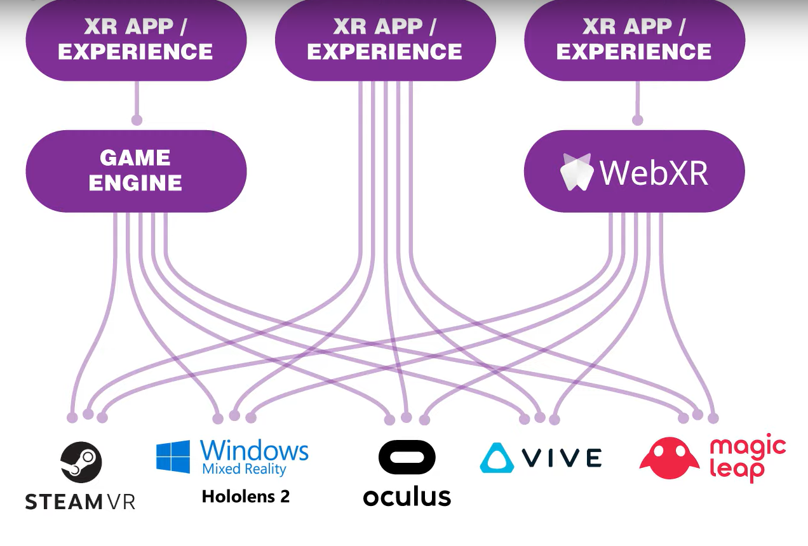
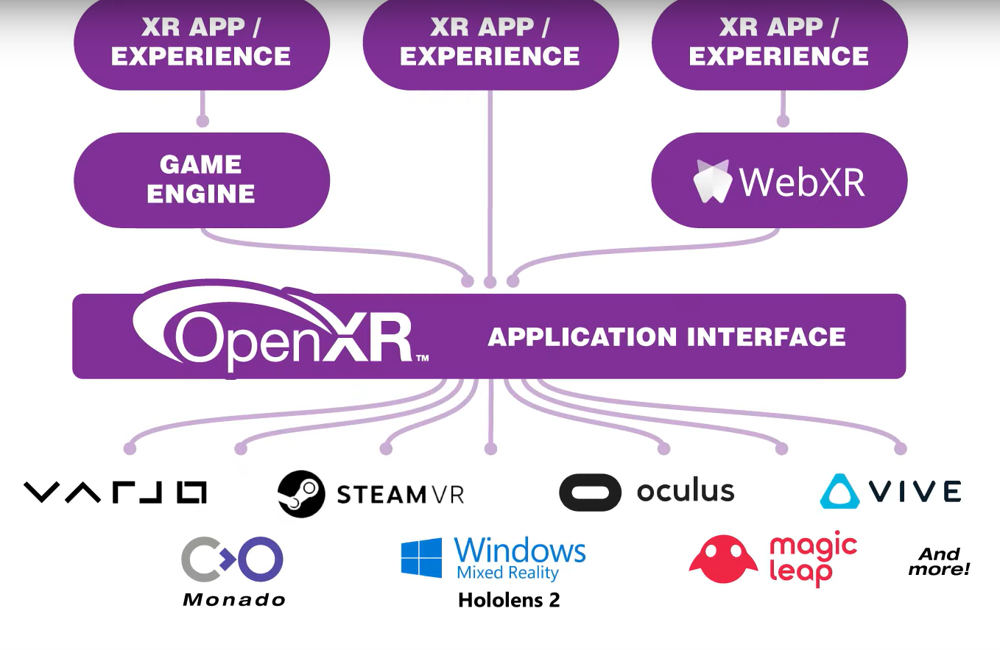

# Proyectos y Justificación

En este breve documento veremos rápidamente cómo vamos a estructurar los proyectos y la justificación de las herramientas que vamos a utilizar. Al ser el primer año que se imparte el curso, no podemos saber qué nivel va a desarrollar el alumnado con lo que es complicado establecer de inicio un proyecto en concreto o el número de proyectos a hacer, además, hay que tener en cuenta que la segunda parte del curso estará dedicada en parte a un proyecto grupal que seguramente vaya a consumir tiempo de clase.

Dejando esto de lado, creemos que es interesante hablar sobre los proyectos / juegos a desarrollar con los alumnos, por una parte por lo que acabamos de mencionar sobre el nivel y por otra porque haciéndolos partícipes, podemos encontrar proyectos que los motiven más y obtener muchos mejores resultados. 

En los documentos [Proyecto RV](https://github.com/videojuegos-abastos/RVRA/blob/main/te/t4_proyecto_RV.md) y [Proyecto RA](https://github.com/videojuegos-abastos/RVRA/blob/main/te/t5_proyecto_RA.md) veremos más en concreto qué proyectos se desarrollarán a lo largo del curso.

## Herramientas RV

Para crear juegos / experiencias para Realidad Virtual, pensamos que lo mejor es utilizar [Open XR](https://www.khronos.org/openxr/) junto con [XR Interaction Toolkit](https://docs.unity3d.com/Packages/com.unity.xr.interaction.toolkit@0.9/manual/index.html). El por qué es sencillo, lo primero es que `Open XR` nos permite olvidarnos del dispositivo de RV para el que estamos desarrollando, con lo que el código será exactamente igual para unas gafas u otras.

`Open XR` es una especie de capa de abstración del hardware.

Sin `Open XR`.

Con `Open XR`.

A parte, `XR Interaction Toolkit` funciona con `Open XR` con lo que es obvio que para utilizar uno, utilizaremos también el otro.

`XR Interaction Toolkit` es la herramienta oficial desarrollada por Unity y proporciona clases que nos hacen totalmente transparente la interacción compleja entre algunos elementos. Esto hace que el desarrollo sea mucho más sencillo y rápido.

> [Vídeo resumen](https://www.youtube.com/watch?v=5ZBkEYUyBWQ) sobre `Open XR` y algunas de las cosas más importantes que nos facilita `XR Interaction Toolkit`. Utilizaremos este vídeo más adelante también.

---

## Herramientas RA

Para la Realidad Aumentada, utilizaremos [Vuforia](https://developer.vuforia.com/). (Falta completar)