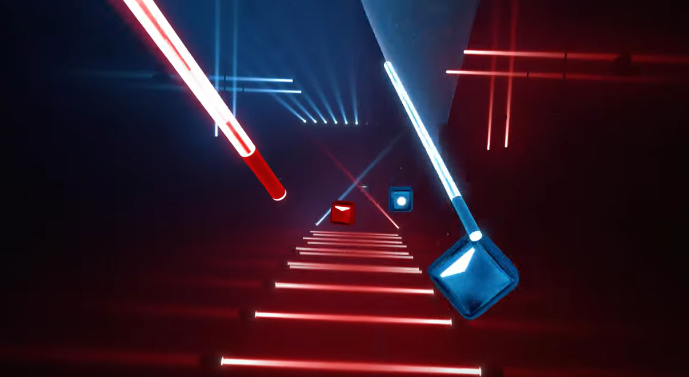
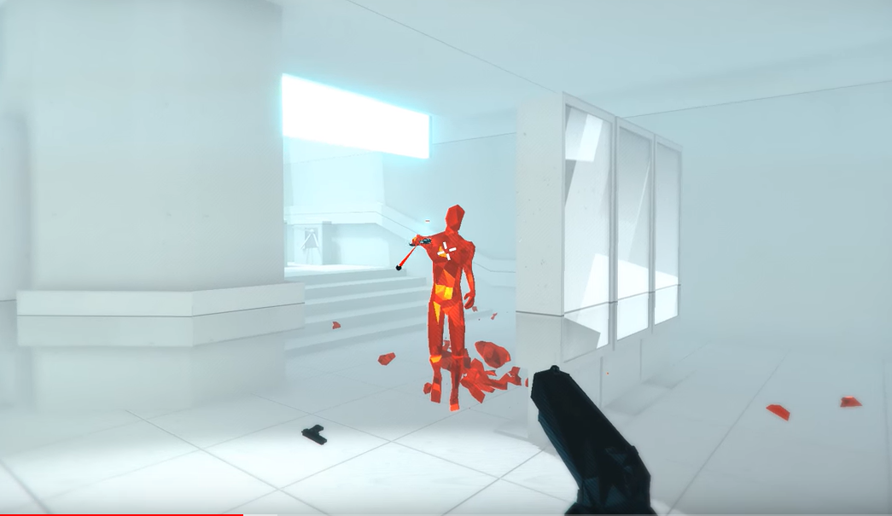

# Proyecto RV

## XR Interaction Toolkit

Como sabemos, vamos a utilizar los componentes que nos proporciona el `XR Interaction Toolkit`, como es normal, no sabremos qué hacen o cómo se usan los componentes, para ello debemos consultar la [Documentación](https://docs.unity3d.com/Packages/com.unity.xr.interaction.toolkit@0.9/manual/index.html).

A parte de la documentación, hay ejemplos que utilizan el toolkit desarrollados para que podamos copiar los componentes y objetos, estos los hemos usado en clase y los podemos encontrar en el repositorio de Github [XR-Interaction-Toolkit-Examples](https://github.com/Unity-Technologies/XR-Interaction-Toolkit-Examples).

Aunque hemos explicado lo más básico sobre algunos de estos componentes en clase y tenemos la documentación y ejemplos, es extremadamente recomendable ver vídeos explicativos ya que se hace mucho más ameno que leer y por lo general vamos a acabar entendiendo mejor las cosas. [Vídeo introducción a XR Interaction Toolkit](https://youtu.be/5ZBkEYUyBWQ?t=540).

> A parte del vídeo adjunto existen mucho más, cuantos más vemamos y más claras tengamos las cosas mejor. No olvidemos eso sí que solo viendo vídeos no vamos a saber hacer las cosas, será necesario ponerlas en práctica.

## Proyecto 0: Configuración

Configurar las gafas de realidad virtual para el desarrollo no es nada sencillo, seguiremos el siguiente [Documento de configuración](https://github.com/videojuegos-abastos/RVRA/blob/main/te/configuracion.md)

## Proyecto 1: Beat Saber

Como primer proyecto creremos una 'copia' del juego [Beat Saber](https://beatsaber.com/). De esta forma aprenderemos a utilizar algunos elementos del `XR Interaction Toolkit` como el `XROrigin`, o los interactuables como el `XR Controller` o el `XRGrabInteractible` por ejemplo.

La ventaja de hacer este juego es que no tenemos que movernos con lo que no vamos a preocuparnos por ahora de las clases que proporcionan movimiento. Además, la programación y diseño de los aspectos del juego que no están relacionados con la relidad virtual son relativamente sencillos con lo que nos quitarán un tiempo mínimo y podremos centrarnos en lo que nos interesa.

Aunque es una de las claves del juego real, nosotros no implementaremos música ni niveles, los cubos serán aleatorios.

> [Gameplay Beat Saber](https://www.youtube.com/watch?v=py2bnYWhuJI)

---

## Proyecto 2: Super Hot

Como segundo proyecto, una vez sabemos un poco mejor cómo funcionan algunas de las clases del `XR Interaction Toolkit`, pensamos que es buena idea desarrollar una 'copia' de [Super Hot](https://superhotgame.com/). Obviamente, no implementaremos ningún tipo de efecto visual, trabajaremos con geometría básica y sin animaciones.

Para este proyecto sí que será necesario utilizar tanto las clases para implementar el movimiento como las acciones de los mandos para los disparos por ejemplo.

> [Gameplay Super Hot](https://www.youtube.com/watch?v=ygyJUJowKQk)